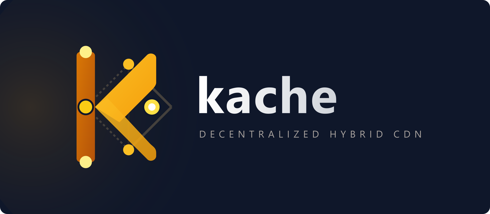

<p align="center">
  
</p>

# Kache: Hybrid Decentralized Content Delivery Network (dCDN)

**Kache** is a high-performance, hybrid decentralized Content Delivery Network (dCDN) written in Go. It combines the structured lookups and decentralization of a Kademlia Distributed Hash Table (DHT) with performance-oriented edge CDN features, such as network latency sorting via exponentially weighted moving averages (EWMA).

By leveraging peer-to-peer (P2P) mesh architectures, **Kache** treats individual nodes as self-contained edge routers capable of caching, replicating, and streaming content from the geographically or topologically closest available peer in the swarm.

---

## Key Features

* **Kademlia DHT Routing Engine:** Employs a dedicated Kademlia routing table (`go-libp2p-kad-dht`) operating in Server mode to index content providers and map asset locations securely across a permissionless network.
* **Latency-Aware Load Balancing:** Dynamically measures and ranks content providers via Peerstore's `LatencyEWMA`. Assets are systematically retrieved from the lowest-latency edge nodes to optimize Time-To-First-Byte (TTFB).
* **Dual Transport Architecture:** Supports hybrid connection pipes running concurrent TCP and QUIC (UDP) stream multiplexing out of the box for high-throughput data replication.
* **Zero-Configuration Mesh Networking:** Automatically synthesizes local network meshes through a background multicast mDNS discovery layer (`kache-private-mesh`), bypassing the need for fixed bootstrap nodes in localized clusters.
* **LRU Storage Manager with Time-To-Live (TTL):** Combines disk-backed local storage limits with true Last-Recently-Used (LRU) content eviction and an automated background janitor loop to continuously sweep expired items.
* **Proactive Swarm Replication:** Automatically computes target XOR-distance metrics via the DHT to push redundant content chunks to the closest physical neighbor nodes upon asset ingress.
* **Structured System Observability:** Utilizes zero-allocation unified standard structured logging interfaces (`log/slog`) containing contextual `module` tags and telemetry markers, mapping clear visibility to network operations.

---

## Architecture Overview

```

                  ┌────────────────────────────────────────┐
                  │             HTTP Client Layer          │
                  └───────────────────┬────────────────────┘
                                      │ (REST Requests)
                                      ▼
                  ┌────────────────────────────────────────┐
                  │         API Server (Gin Engine)        │
                  └───────────────────┬────────────────────┘
                                      │
               ┌──────────────────────┴──────────────────────┐
               ▼                                             ▼
┌──────────────────────────────────────┐      ┌──────────────────────────────────────┐
│        Cache Manager Engine          │      │         Kademlia DHT Engine          │
│  (LRU Eviction / TTL Background Scan)│      │  (Content Providers & XOR Routing)   │
└──────────────────────────────────────┘      └──────────────────┬───────────────────┘
                                                                 │
                                                                 ▼
                                              ┌──────────────────────────────────────┐
                                              │          libp2p Network Host         │
                                              │      (TCP / QUIC Streams & mDNS)     │
                                              └──────────────────────────────────────┘
```

The system splits roles across four modular segments:

1. **Daemon Container (`main.go`)**: Manages startup flags, registers OS interrupt signals, provisions block subsystems, and ensures graceful system teardown.
2. **API Gateway (`api.go`)**: Serves as the developer boundary, accepting standard HTTP REST requests while simultaneously managing underlying custom raw P2P data streams over libp2p protocols.
3. **DHT Routing Module (`dht.go`)**: Tracks layout maps, schedules asynchronous asset indexing providers, and calculates target replicate lists.
4. **Cache Core (`cache.go`)**: Synchronizes local directory structures on the host file system, handles write protection policies, and orchestrates space reclamation loops.

## Build and test

```bash
git clone [https://github.com/filippo-ferrando/kache.git](https://github.com/filippo-ferrando/kache.git)
cd kache
go build -o dcdnd ./cmd/dcdnd/main.go
# build CLI tool
go build -o kachectl ./cmd/kache/main.go
```

### Test the CDN with

```bash
dcdnd --api <ip>:<port> --cache ./<cache dir path> --cache-ttl 10m --cache-size 1G
```

You can then interact with the CDN using `kachectl`

```bash
kachectl status --endpoint http://<ip>:<port>
```
